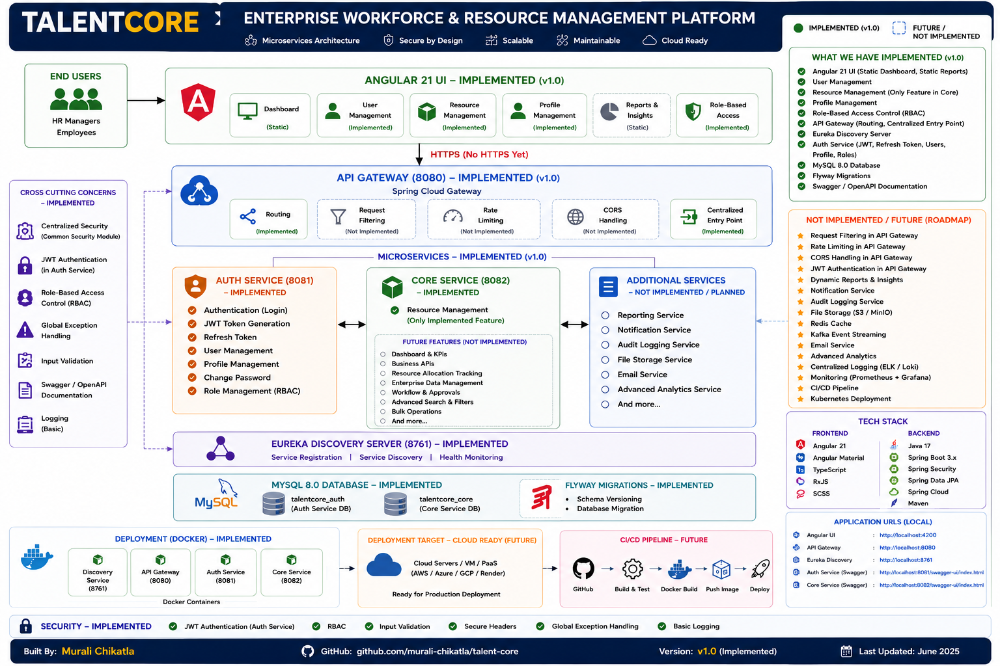
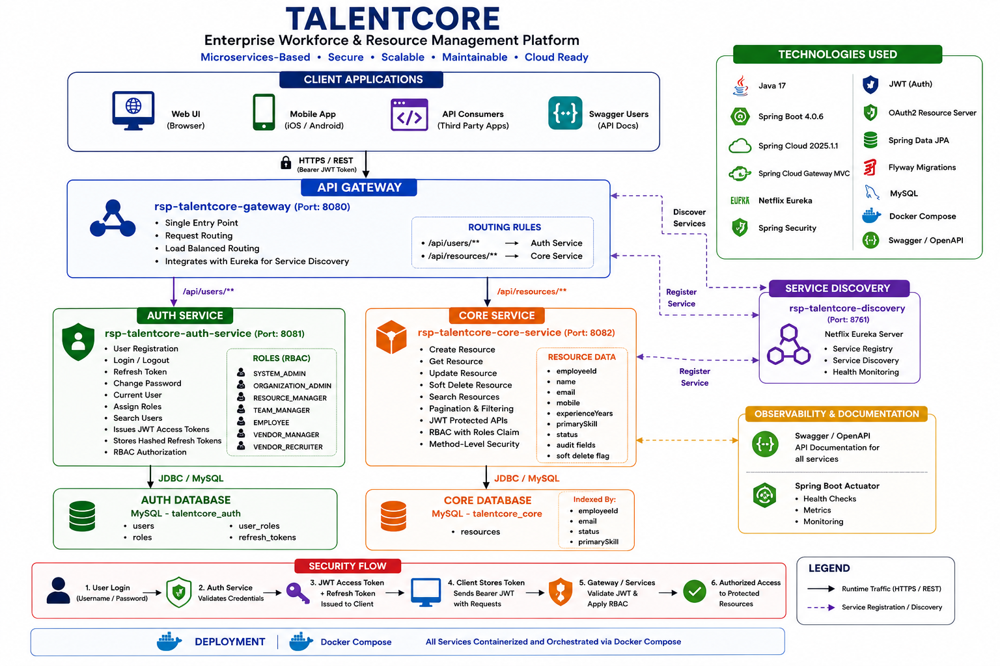
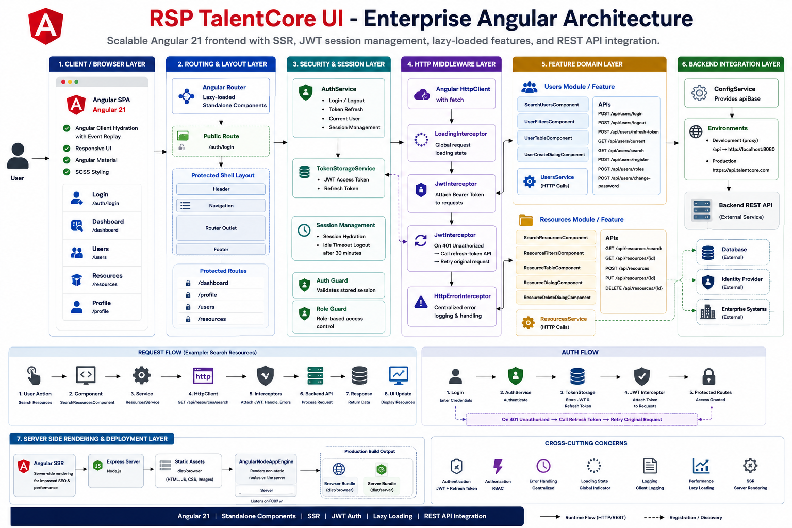
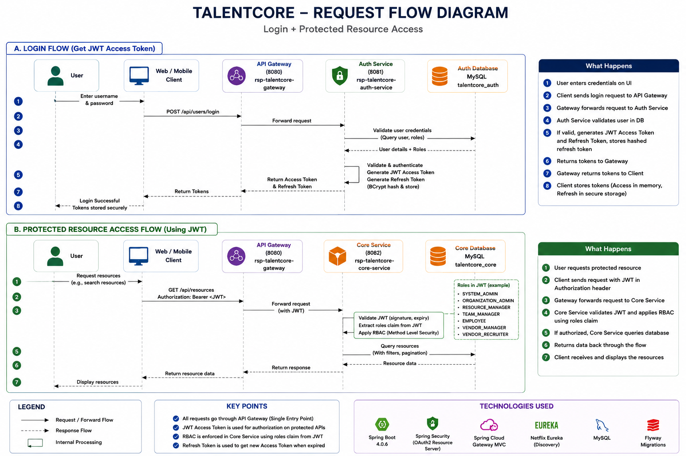

# TalentCore

## Enterprise Workforce & Resource Management Platform

TalentCore is an enterprise-grade workforce and resource management platform built using Angular 21 and Spring Boot microservices architecture.

The platform centralizes authentication, authorization, user management, profile management, and resource management through a scalable and secure architecture designed using modern enterprise software engineering principles.

---

## Overview

Organizations often manage employees, contractors, resources, vendors, and operational data across multiple disconnected systems.

This creates:

- Data duplication
- Security challenges
- Manual processes
- Limited visibility
- Inefficient resource utilization

TalentCore addresses these challenges by providing a centralized platform that streamlines workforce and resource management while supporting future enterprise growth through a scalable microservices architecture.

---

## Key Features

### Authentication & Security

- JWT Authentication
- Refresh Token Support
- Role-Based Access Control (RBAC)
- Current User Profile
- Change Password
- Secure Password Encryption using BCrypt
- Method-Level Authorization

### User Management

- User Registration
- User Search
- User Administration
- Role Assignment
- Profile Management

### Resource Management

- Create Resources
- Search Resources
- Update Resources
- Soft Delete Resources
- Pagination Support
- Dynamic Search Capabilities

### Platform Services

- API Gateway
- Service Discovery
- Swagger/OpenAPI Documentation
- Database Migrations with Flyway
- Dockerized Deployment

---

## Technology Stack

### Frontend

- Angular 21
- Angular Material
- TypeScript
- RxJS
- SCSS
- Standalone Components
- Lazy Loading
- Angular SSR

### Backend

- Java 17
- Spring Boot
- Spring Security
- Spring Data JPA
- Spring Validation
- Maven

### Microservices

- Spring Cloud Gateway MVC
- Netflix Eureka Service Discovery

### Security

- JWT Authentication
- Refresh Tokens
- RBAC Authorization
- BCrypt Password Hashing
- OAuth2 Resource Server

### Database

- MySQL 8

### DevOps

- Docker
- Docker Compose

### Documentation & Monitoring

- Swagger/OpenAPI
- Spring Boot Actuator
- Flyway

---

# Architecture

## Complete Solution Architecture



## Backend Microservices Architecture



## Angular UI Architecture



## Authentication & Protected Resource Access Flow



---

# System Architecture

```text
Users
   |
   v
Angular 21 UI
   |
   v
API Gateway (8080)
   |
   +------------------------+
   |                        |
   v                        v

Auth Service          Core Service
(8081)                (8082)

   |                        |
   v                        v

talentcore_auth      talentcore_core

          |
          v

Eureka Discovery
(8761)
```

---

# Microservices

## Discovery Service

Port: 8761

Responsibilities:

- Service Registration
- Service Discovery
- Central Service Registry

---

## API Gateway

Port: 8080

Responsibilities:

- Central Entry Point
- Request Routing
- Service Discovery Integration

Routes:

```text
/api/users/**      -> Auth Service
/api/resources/**  -> Core Service
```

---

## Auth Service

Port: 8081

Responsibilities:

- Authentication
- JWT Token Generation
- Refresh Token Management
- User Management
- Role Management
- Profile Management
- Password Management

---

## Core Service

Port: 8082

Responsibilities:

- Resource Management
- Resource Search
- Resource Updates
- Soft Delete Operations

---

# Security Architecture

TalentCore implements enterprise-grade authentication and authorization using JWT and RBAC.

## Authentication Flow

1. User logs in
2. Auth Service validates credentials
3. JWT Access Token generated
4. Refresh Token generated
5. Angular stores session securely
6. Client accesses protected APIs using Bearer Token

## Authorization

Supported Roles:

- SYSTEM_ADMIN
- ORGANIZATION_ADMIN
- RESOURCE_MANAGER
- TEAM_MANAGER
- EMPLOYEE
- VENDOR_MANAGER
- VENDOR_RECRUITER

Role-based permissions are enforced using Spring Security method-level authorization.

---

# Database Design

## talentcore_auth

Purpose:

Authentication and Identity Management

Tables:

- users
- roles
- user_roles
- refresh_tokens

---

## talentcore_core

Purpose:

Workforce Resource Management

Tables:

- resources

Stores:

- Employee Information
- Contact Information
- Skills
- Status
- Audit Metadata
- Soft Delete Information

---

# Frontend Architecture

The Angular application follows a modular enterprise architecture.

Features:

- Login
- Dashboard
- Profile
- User Management
- Resource Management

Architecture Highlights:

- Standalone Components
- Angular Router
- Route Guards
- JWT Session Management
- HTTP Interceptors
- Angular Material UI
- Lazy Loading
- SSR Support

---

# API Documentation

Swagger UI

Auth Service:

```text
http://localhost:8081/swagger-ui/index.html
```

Core Service:

```text
http://localhost:8082/swagger-ui/index.html
```

---

# Local Development

## Start Backend

Start services in the following order:

1. Discovery Service
2. Auth Service
3. Core Service
4. API Gateway

---

## Start Angular UI

```bash
npm install
npm start
```

Application URL:

```text
http://localhost:4200
```

---

# Application URLs

| Component | URL |
|------------|------|
| Angular UI | http://localhost:4200 |
| API Gateway | http://localhost:8080 |
| Eureka Discovery | http://localhost:8761 |
| Auth Swagger | http://localhost:8081/swagger-ui/index.html |
| Core Swagger | http://localhost:8082/swagger-ui/index.html |

---

# Docker Deployment

TalentCore supports containerized deployment using Docker Compose.

Containerized Services:

- Discovery Service
- API Gateway
- Auth Service
- Core Service
- MySQL

Deployment Command:

```bash
docker compose up -d
```

---

# Future Roadmap

## Workforce Management

- Team Management
- Project Management
- Vendor Management

## Reporting

- Reports & Analytics
- Executive Dashboards

## Platform Enhancements

- Notification Service
- Audit Logging
- File Management

## Cloud & DevOps

- Cloud Deployment
- CI/CD Pipeline
- Kubernetes
- Centralized Monitoring

---

# Project Highlights

This project demonstrates practical experience in:

- Enterprise Software Design
- Angular Enterprise Frontend Development
- Spring Boot Microservices
- API Gateway Pattern
- Service Discovery Pattern
- JWT Authentication
- RBAC Authorization
- Spring Security
- REST API Design
- Database Per Service Architecture
- Dockerized Deployments
- Secure Authentication Patterns
- Scalable System Design

---

# Author

## Murali Chikatla

Senior Software Engineer

TalentCore is a portfolio-quality enterprise application designed to demonstrate modern software architecture, microservices development, secure authentication, and scalable workforce management solutions.